Human generated note:

I made this program with the intent of speeding up the process of making, reviewing, keeping track of, etc. song covers with the yue2 music model and the sheetsage2 transcription model. It supports using multiple GPUs (multiple audio.cpp servers) to generate multiple songs simultaneously.

Machine generated below:

# IncreMusic-Yue2

Desktop app (Rust, egui) for batch song generation with one or more
[audio.cpp](docs/DESIGN.md#1-background-the-audiocpp-server-api) servers: launch servers,
transcribe a reference to ABC with SheetSage2, generate batches with YuE2 across all GPUs,
and review/organize the results. See [docs/DESIGN.md](docs/DESIGN.md).

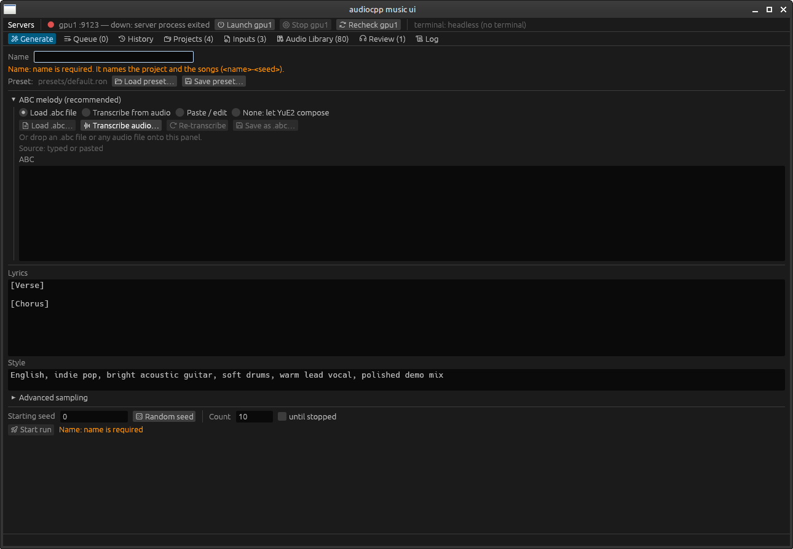

## Screenshots

The server bar at the top shows each server's state and the job it's running. Songs are
played from any tab, and the current one shows at the right of the tab bar.

### Generate

Set a name, then give YuE2 a melody: load an `.abc` file, transcribe one from any audio
file with SheetSage2, paste one in, or let YuE2 compose. Add lyrics and a style, pick a
starting seed and how many songs to make (or *until stopped*), and start the run. The
name is kept afterwards, and the seed moves past the run just started.

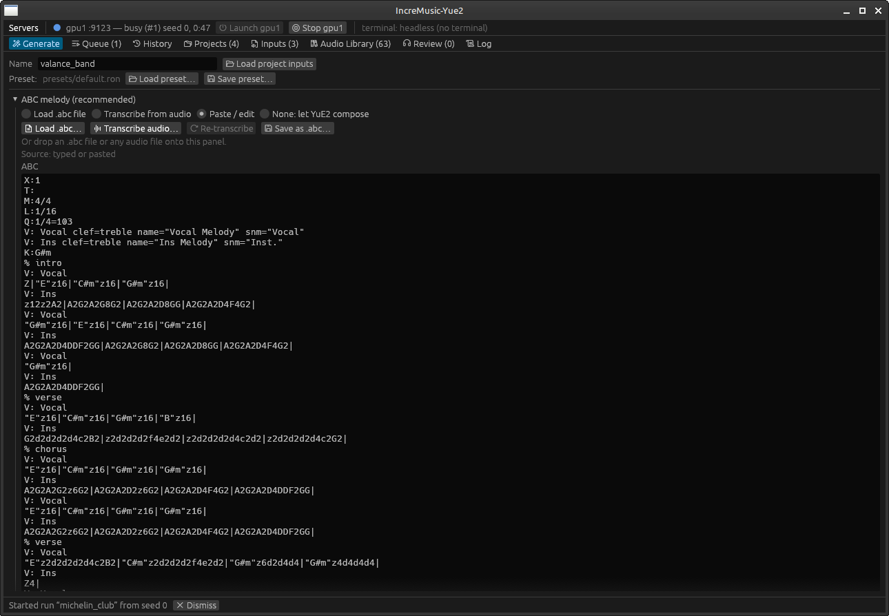
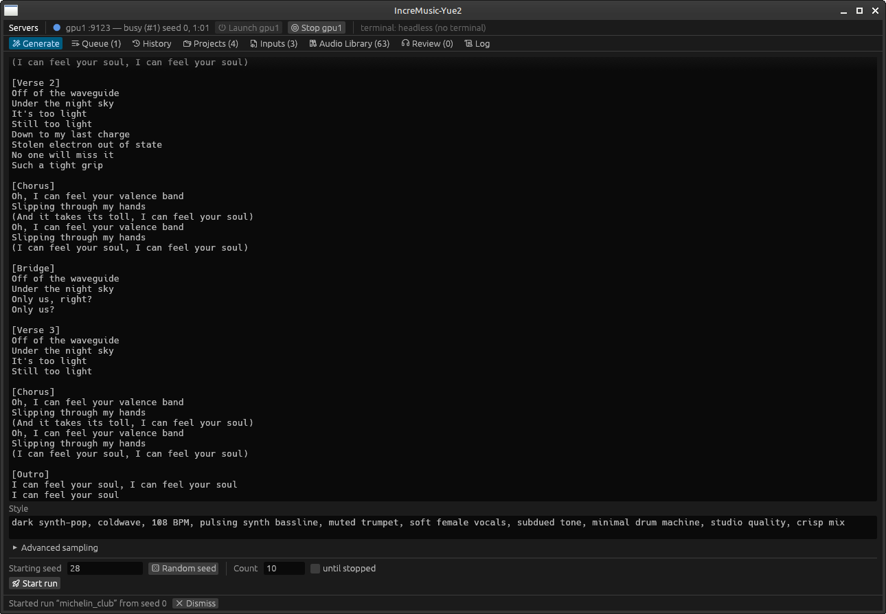

### Queue

Runs waiting or in progress, with each running seed and the server it's on. Runs can be
paused, stopped, edited, reordered, or loaded back into Generate.

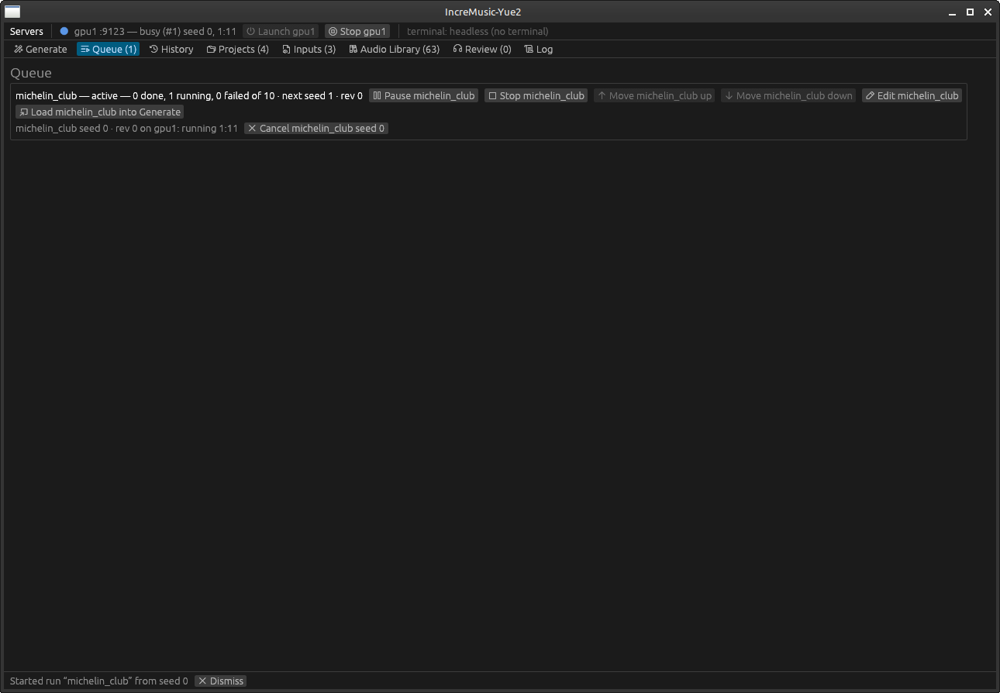

### History

Every run is recorded, newest first. Select one to load it, or one of its revisions, into Generate. Click a column header to sort by it; click it again to reverse.

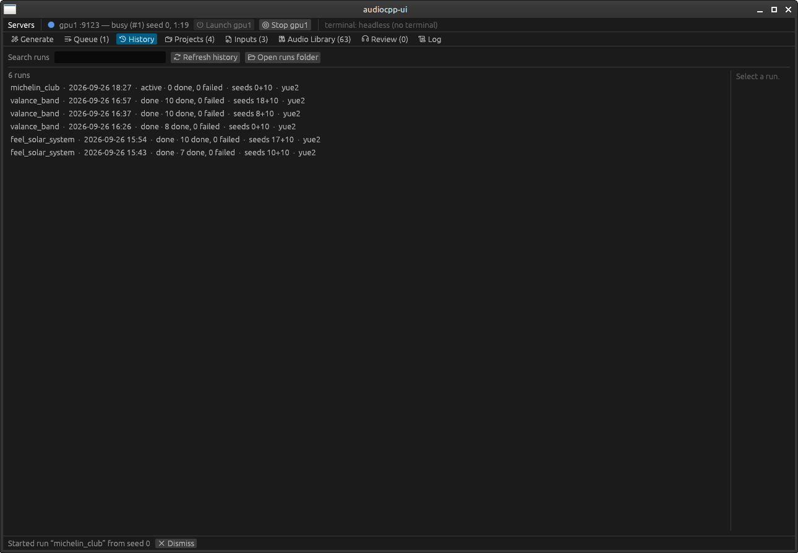

### Projects

One project per name, holding its reference audio, transcription and ABC. Click a column header to sort by it; click it again to reverse.

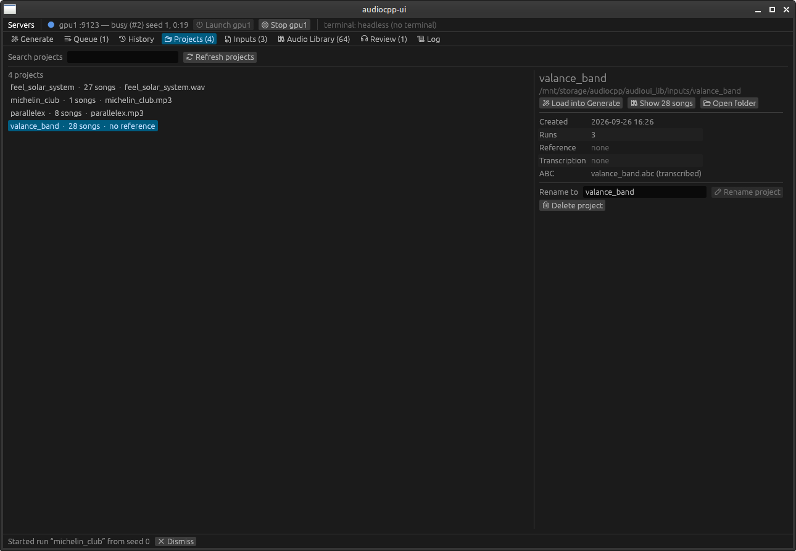

### Inputs

Reference audio files: play them, use one in the current project, or transcribe it again. Click a column header to sort by it.

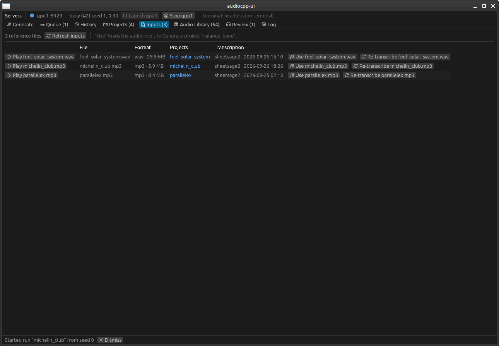
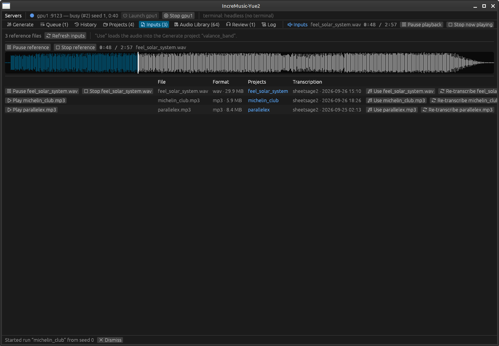

### Audio Library

Every generated song, filtered by folder, text, tag, run name, seed range or revision.
Rate, tag, rename, continue a run, regenerate, or export as MP3, WAV or FLAC. Each song
keeps the recipe it was made from. MP3 exports also carry the project's keypoints as chapters.

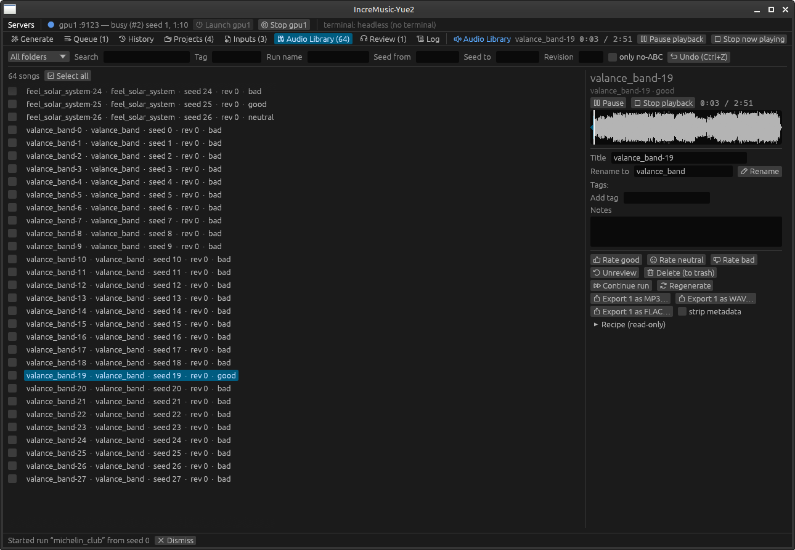

### Review

Go through unreviewed songs one at a time with the keyboard: Space plays and pauses,
1/2/3 rates good/neutral/bad and moves on.
C also rates bad, but first asks if the song has played for less than 30 seconds.
The keypoints pane on the right keeps a project's moments worth checking, such as the
chorus or a tricky line. Each has an optional name and pre-roll. *Review next keypoint*
(X) jumps through them in the order you set, and Z goes back one.

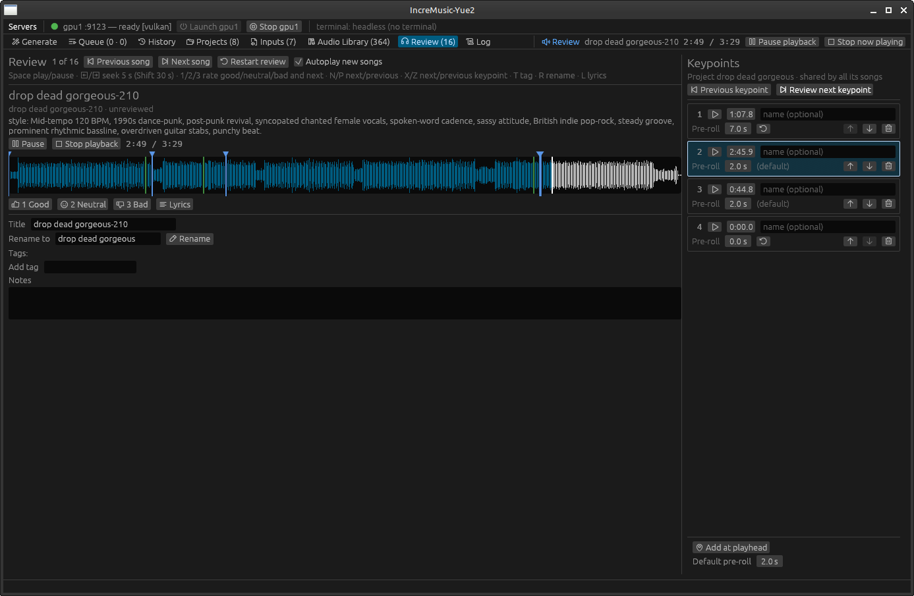

### Log

The app's own messages and each server's output, merged by time.

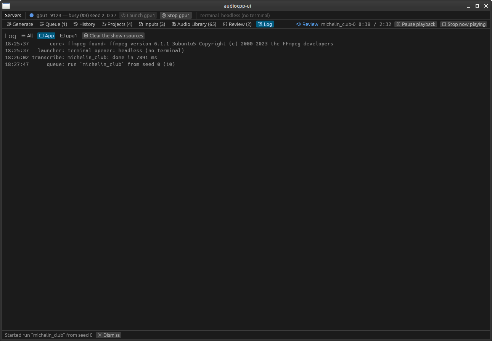

## Layout

| Crate | What |
|---|---|
| `crates/incremusic-core` | config, launcher, API client, scheduler, media, library, playback, `CoreHandle` — no GUI deps |
| `crates/incremusic-gui-core` | `AppState` + pure `update()` reducer — no egui |
| `crates/incremusic-gui` | egui/eframe view and the `incremusic-yue2` binary |

## Requirements

- Rust 1.88+ (edition 2024)
- `ffmpeg` and `ffprobe` on `PATH` (or `ffmpeg:` in the config)
- Linux: ALSA development files (`libasound2-dev`) for audio output. Build without audio
  with `cargo build -p incremusic-gui --no-default-features`.

## Run

```sh
cp config.example.ron ~/.config/incremusic-yue2/config.ron   # edit paths, ports, devices
cargo run --release -p incremusic-gui -- [--config path/to/config.ron]
```

## Test

```sh
cargo test --workspace                 # unit, mock-server integration and headless GUI tests
INCREMUSIC_REQUIRE_FFMPEG=1 cargo test   # fail instead of skip when ffmpeg is missing
# against a real server (generates one short song):
AUDIOCPP_SERVER_URL=http://127.0.0.1:8080 cargo test -p incremusic-core --test real_server -- --ignored
```

The HAR captures used to derive `tests/fixtures/` are not committed (`*.har` is ignored).

## License

[MIT](LICENSE)
